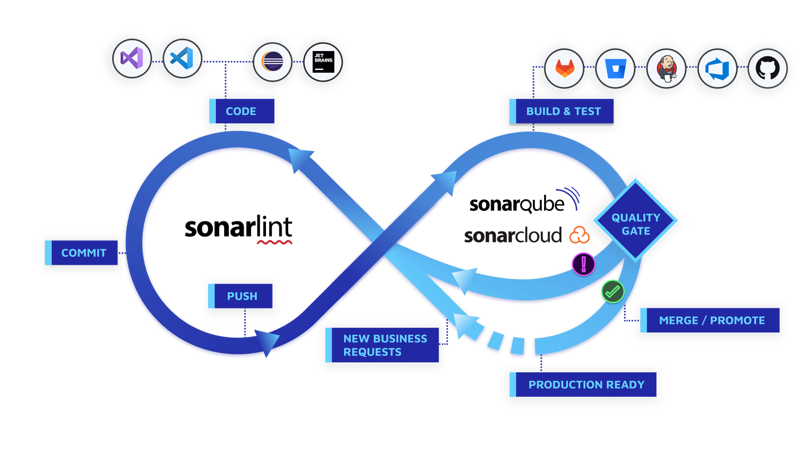

This is a [Next.js](https://nextjs.org/) project bootstrapped with [`create-next-app`](https://github.com/vercel/next.js/tree/canary/packages/create-next-app).

## Getting Started

First, run the development server:

```bash
npm run dev
# or
yarn dev
# or
pnpm dev
# or
bun dev
```

[](https://sonarcloud.io/summary/new_code?id=minchansike_my-nextjs-app)

### [Linting, Formatting, and Pre-commit Setup in NextJS](https://mario-gunawan.medium.com/setting-up-linting-formatting-and-pre-commit-in-nextjs-b3f8001d40cb)

`npm run prepare` <br/>
`npx husky add .husky/pre-commit "npx lint-staged"`

### Note

- Test for pre-commit
- sonarLint connected mode analyzie
- [sonarCloud scaner for linux](https://binaries.sonarsource.com/Distribution/sonar-scanner-cli/sonar-scanner-cli-5.0.1.3006-linux.zip)
- [sonarCloud scaner for windows](https://binaries.sonarsource.com/Distribution/sonar-scanner-cli/sonar-scanner-cli-5.0.1.3006-windows.zip)

[SonarLint VSCode](https://docs.sonarsource.com/sonarlint/vs-code/)


**SonarLint**:

- **Local analysis**: Integrates with popular IDEs like IntelliJ IDEA, Visual Studio, and Eclipse.
- **Immediate feedback**: Detects coding issues, bugs, and vulnerabilities as you code, like a spell checker.
- **Lightweight**: Requires minimal overhead on your system and doesn't upload your code to any server.
- **Free**: Open-source and completely free to use for both personal and commercial projects.
- **Connection**: Can be connected to SonarQube or SonarCloud for additional features and centralized dashboards.
